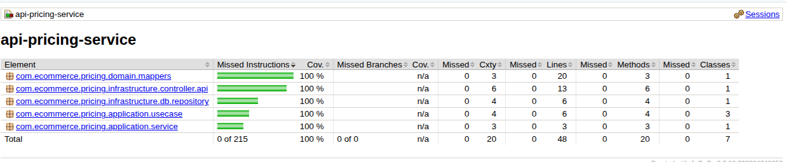
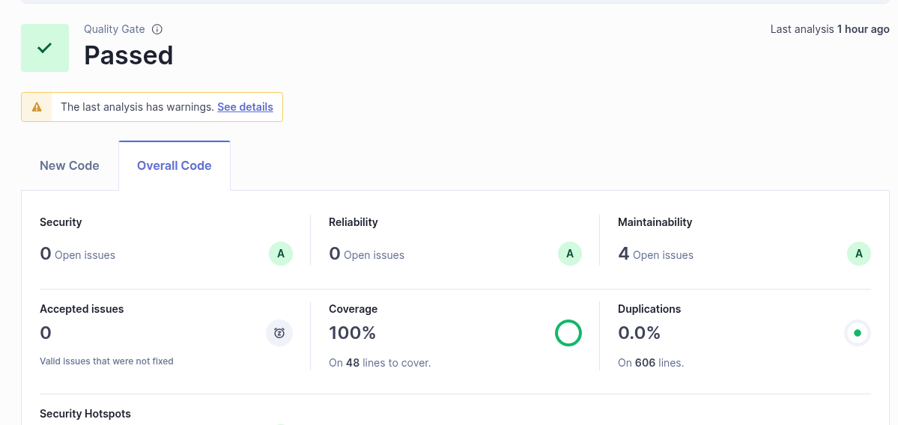
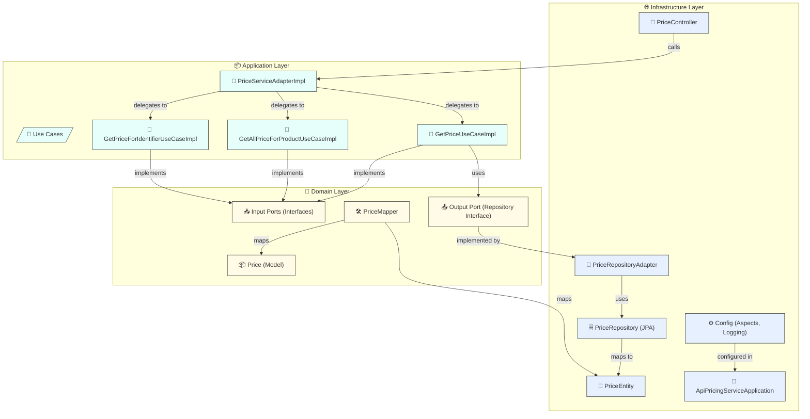
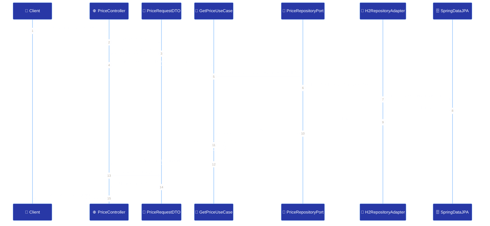
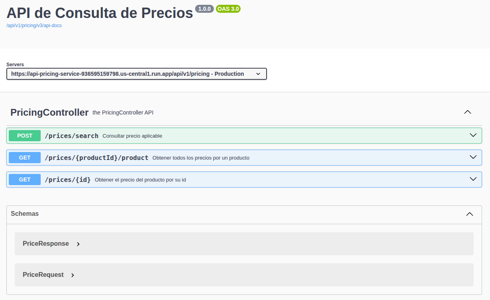
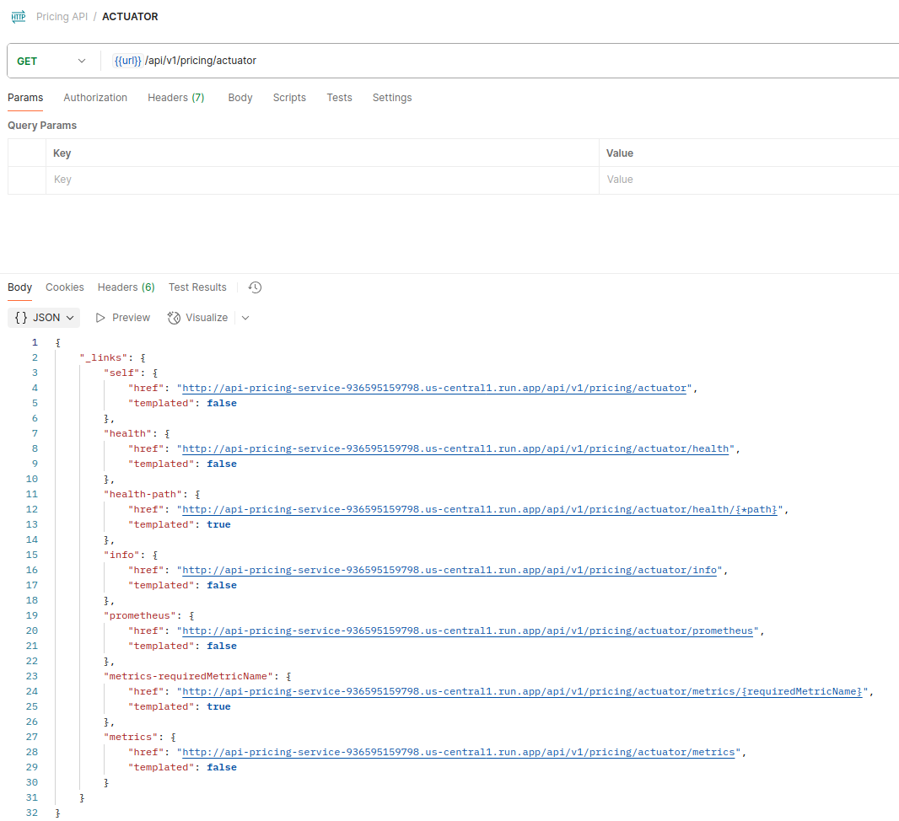
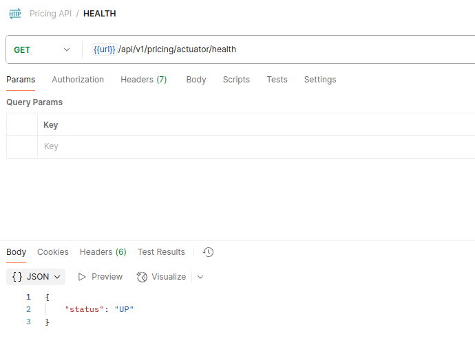

# 🛍️ API Pricing 


> API para gestionar precios y tarifas de los productos que estan en descuentos en una plataforma de e-commerce, desarrollada con Spring Boot siguiendo el patrón de arquitectura hexagonal.

---

## 📚 Índice

- [🎯 Descripción](#description)
- [⚙️ Instalación y Configuración](#config)
- [🧪 Ejecución de Tests](#execution-test)
- [🏗️ Arquitectura](#architecture)
- [🧬 Diagrama de Secuencia](#diagrama-sequence)
- [🚀 Flujo de CI/CD](#diagrama-cicd)
- [🔧 Endpoints Principales](#endpoint)
- [💡 Stack Tecnológico](#stack)
- [📂 Estructura del Proyecto](#endpoint)

---

## 🎯 Descripción <a id="description"></a>

Esta API expone precios y tarifas asociadas a productos. Provee endpoints para consultar precios vigentes por fechas y reglas de tarifas. Está diseñada para integrarse con otros microservicios de un ecosistema e-commerce más amplio.

---

## ⚙️ Instalación y Configuración <a id="config"></a>

La instalacion en un entorno local, tiene una seríe de pre requisitos que se debe de configurar para poder realizar la compilación, startup de la aplicación, test, reportes y hasta el despliegue en un erotno Cloug como GCP. Donde desplegaremos en el servicio de Cloud Run(tener conocimietos previos enm IAM, Habilitar Endpoint, Configurar Artifacts).

🖥️ Pre requisitos

* Java 21
* Gradle 3.9+
* Docker & Docker Compose
* Spring Boot
* Intellij IDEA o Eclipse
* Postman
* Gcloud + Cloud Run
* Sonar

## 🚀 Instalación 

```bash
# Clona el repositorio
git clone https://github.com/jalvarova/api-pricing-service.git

# Instalacion de commit lint
chmod +x .git/hooks/commit-msg

# Configuracion de la de lint
git commit -m "actualizacion"

# ❌ será rechazado
git commit -m "fix() corrige error de zona horaria"

# ✅ será aceptado
git commit -m "fix(api): corrige error de zona horaria"

# 
cd api-pricing-service

# Generate contract API en el proyecto
./gradlew clean openApiGenerate build

# Ejecuta la aplicación
./gradlew bootRun
```

> Configurar Google Cloud, construir imagen con Docker y desplegar con Cloud Run

```bash
export GCP_PROJECT_ID=project_id
export REGION=us-central1
export GITHUB_SHA=$(git rev-parse HEAD)
export URL_DATABASE='jdbc:h2:mem:testdb\;DB_CLOSE_DELAY=-1\;DB_CLOSE_ON_EXIT=FALSE'
export USER_DATABASE=sa
export APP_PORT=8080

gcloud auth activate-service-account --key-file=service-accorunt.json

gcloud config set project $GCP_PROJECT_ID

gcloud artifacts repositories list --location=us-central1


docker build -t ${REGION}-docker.pkg.dev/${GCP_PROJECT_ID}/api-pricing-repo/api-pricing-service:$GITHUB_SHA .

docker push ${REGION}-docker.pkg.dev/${GCP_PROJECT_ID}/api-pricing-repo/api-pricing-service:$GITHUB_SHA

gcloud run deploy api-pricing-service \
            --image ${REGION}-docker.pkg.dev/${GCP_PROJECT_ID}/api-pricing-repo/api-pricing-service:$GITHUB_SHA \
            --region ${REGION} \
            --platform managed \
            --allow-unauthenticated \
            --set-env-vars URL_DATABASE=$URL_DATABASE,USER_DATABASE=$USER_DATABASE,APP_PORT=$APP_PORT
```

> Configuración opcional de HV

```bash
export VAULT_ADDR=http://localhost:8200
export VAULT_TOKEN=root-token

vault kv put secret/api/pricing-v1 \
  spring.datasource.username=sa \
  spring.datasource.url='jdbc:h2:mem:testdb;DB_CLOSE_DELAY=-1;DB_CLOSE_ON_EXIT=FALSE' \
  spring.data.redis.password='mysecretpass' \
  spring.data.redis.user='default' \
  spring.data.redis.host=localhost

vault kv get secret/api/pricing-v1
```

---

## 🧪 Ejecución de Tests <a id="execution-test"></a>

Los test estamos imnplementando Test unitarios y de integracion siguiento el patrón BDD para escribir los test y probar la aplicación, dando como resultado los reportes de cobertura de código en Jacoco y Sonar. Para ellos deben de habilitar un Sonar local y crear un token para poder ingestar las resultados.

> Sonar Local com Docker Compose

```yml
version: '3.8'

services:
  sonarqube:
    image: sonarqube:community
    container_name: sonarqube
    ports:
      - "9000:9000"
    environment:
      SONAR_ES_BOOTSTRAP_CHECKS_DISABLE: "true"
      SONAR_JDBC_URL: jdbc:postgresql://db:5432/sonar
      SONAR_JDBC_USERNAME: sonar
      SONAR_JDBC_PASSWORD: sonar
    depends_on:
      - db

  db:
    image: postgres:13
    container_name: sonar-postgres
    environment:
      POSTGRES_USER: sonar
      POSTGRES_PASSWORD: sonar
      POSTGRES_DB: sonar
    volumes:
      - sonar-db-data:/var/lib/postgresql/data

volumes:
  sonar-db-data:
```

> Ejecutar los test para ver los resultados y corregir los issue y alcazar el porcentaje aceptado de cobertura.

```bash
# Ejecutar tests unitarios
./gradlew test
# Ejecutar con cobertura
./gradlew test jacocoTestReport
# Ejecutar Sonnar
/gradlew sonar -Dsonar.login=$SONAR_TOKEN
```

> Reporte de Jacoco



> Reporte de Sonar




---

## 🧩 Arquitectura <a id="architecture"></a>

Este proyecto implementa una arquitectura **Hexagonal (puertos y adaptadores)** para garantizar un diseño limpio, desacoplado y alineado con los principios SOLID, facilitando su mantenimiento, escalabilidad y testeo.
El desarrollo se basa en un enfoque **API First**, utilizando **OpenAPI 3** para definir el contrato desde el inicio. A partir del contrato se generan automáticamente los DTOs de entrada y salida, asegurando consistencia entre la interfaz y la lógica interna.

### 🔧 Capas de la arquitectura

#### 1. Dominio (`domain`)

Contiene el núcleo del negocio, sin dependencias externas:

- **Modelo (`model`)**: Define la entidad principal `Price`.
- **Mappers**: Se realiza el Build entre entidades de dominio y estructuras externas.
- **Puertos**:
  - `ports.in`: Interfaces que definen los casos de uso disponibles para el exterior.
  - `ports.out`: Interfaces que abstraen el acceso a servicios externos como bases de datos o caches.

#### 2. Aplicación (`application`)

Contiene la lógica de negocio implementada como **casos de uso**:

- `GetPriceUseCaseImpl`
- `GetAllPriceForProductUseCaseImpl`
- `GetPriceForIdentifierUseCaseImpl`

También incluye servicios que coordinan estos casos de uso (`PriceServiceAdapterImpl`).

#### 3. Infraestructura (`infrastructure`)

Incluye los adaptadores que permiten al sistema interactuar con el mundo exterior:

- **Controladores (`controller.api`)**: Implementan la interfaz REST mediante Spring WebFlux.
- **Base de datos (`db`)**: Implementación de los repositorios y entidades persistentes.

---

## ✅ Ventajas de esta arquitectura

- **Separación clara de responsabilidades.**
- **Lógica del negocio aislada de detalles técnicos.**
- **Facilidad para realizar pruebas unitarias y de integración.**
- **Flexibilidad para reemplazar tecnologías (por ejemplo, base de datos o capa web).**

---

## 📁 Estructura del proyecto

```bash
src
└── main
    └── java
        └── com.ecommerce.pricing
            ├── application
            │   ├── service
            │   └── usecase
            ├── domain
            │   ├── mappers
            │   ├── model
            │   └── ports (in/out)
            ├── infrastructure
            │   ├── config
            │   ├── controller.api
            │   └── db
            └── ApiPricingServiceApplication.java
````

## 🧭 Diagrama de arquitectura

A continuación se presenta un diagrama representativo de la arquitectura hexagonal del servicio:



---

## 🧬 Diagrama de Secuencia <a id="diagrama-sequence"></a>



## 🚀 Flujo de CI/CD <a id="diagrama-cicd"></a>

Este diagrama representa el flujo completo de entrega continua para la **API Pricing Service**, desde el **push** en `main` hasta el despliegue en **Cloud Run**. Incluye las fases de:

1. **CI**: compilación, ejecución de pruebas unitarias y de integración, generación de cobertura con JaCoCo y análisis de calidad con SonarQube.  
2. **CD**: generación de artefactos (JAR y cliente OpenAPI), empaquetado en Docker, subida al Artifact Registry y despliegue automatizado en Cloud Run.  

```mermaid
flowchart LR
  %% CI Section
  subgraph CI ["CI Pipeline"]
    GA["<img src='https://img.shields.io/badge/GitHub_Actions-2088FF?logo=githubactions&logoColor=white' width='32'/><br/> Trigger on Push"]
    JC["<img src='https://img.shields.io/badge/Java-ED8B00?logo=java&logoColor=white' width='32'/><br/>Set up JDK 21"]
    GRADLE["<img src='https://img.shields.io/badge/Gradle-02303A?logo=gradle&logoColor=white' width='32'/><br/>Grant ./gradlew exec"]
    TEST["<img src='https://img.shields.io/badge/Tests%20&%20Coverage-FC515A?logo=jacoco&logoColor=white' width='32'/><br/>Run clean test jacocoTestReport"]
    SONAR["<img src='https://img.shields.io/badge/SonarQube-4E9BCD?logo=sonarqube&logoColor=white' width='24'/><br/>Run sonarqube"]
    GA --> JC --> GRADLE --> TEST --> SONAR
  end

  %% Decision Gate
  SONAR -->|All Checks Passed| DEPLOY
  SONAR -->|Failure| FAIL["❌ Pipeline Fails"]

  %% CD Section
  subgraph CD ["CD Pipeline"]
    BUILD["<img src='https://img.shields.io/badge/Build%20&%20OpenAPI-6CC24A?logo=openapiinitiative&logoColor=white' width='32'/><br/>clean openApiGenerate build --no-daemon"]
    GCP["<img src='https://img.shields.io/badge/Google_Cloud-4285F4?logo=googlecloud&logoColor=white' width='32'/><br/>GCP SDK & Auth"]
    DOCKER_AUTH["<img src='https://img.shields.io/badge/Docker-2496ED?logo=docker&logoColor=white' width='32'/><br/>Configure Auth"]
    DOCKER_BUILD["<img src='https://img.shields.io/badge/Docker_Build-2496ED?logo=docker&logoColor=white' width='32'/><br/>Build Image"]
    DOCKER_PUSH["<img src='https://img.shields.io/badge/Push%20Image-2496ED?logo=docker&logoColor=white' width='32'/><br/>Push to Registry"]
    CR["<img src='https://img.shields.io/badge/Cloud_Run-4285F4?logo=googlecloud&logoColor=white' width='32'/><br/>Deploy to Cloud Run"]
    BUILD --> GCP --> DOCKER_AUTH --> DOCKER_BUILD --> DOCKER_PUSH --> CR
  end

  %% Connections
  DEPLOY([Start CD]) --> BUILD
```




## 💡 Stack Tecnológico <a id="stack"></a>


| Tecnología               | Descripción                                                        | Badge                                                                                   |
| ------------------------- | ------------------------------------------------------------------- | ------------------------------------------------------------------------------------- |
| **Java 21**               | Lenguaje principal para la lógica de negocio y servicios.           |                           |
| **Spring Boot Reactive**  | Framework para crear microservicios y APIs REST.                    |  |
| **Spring Data JPA**       | Abstracción sobre JPA/Hibernate para acceso a datos.                |          |
| **H2 Database**           | Base de datos en memoria para desarrollo y pruebas.                 |           |
| **Docker**                | Contenerización de la aplicación y la base de datos.                |       |
| **Lombok**                | Reducción de código repetitivo (getters, setters, constructores).   |              |
| **Maven**                 | Herramienta de construcción y gestión de dependencias.              |                |
| **JUnit 5**               | Framework de pruebas unitarias.                                     |                   |
| **JaCoCo**                | Medición de cobertura de pruebas.                                   |              |
| **Swagger / OpenAPI**     | Documentación y sandbox de la API REST.                             |             |
| **Mermaid**               | Generación de diagramas en Markdown (arquitectura y secuencias).    |          |
| **Sonar Qube**            | Herramienta de análisis estático para asegurar la calidad del código, detectar errores, vulnerabilidades y mantener buenas prácticas de desarrollo.    |  |
| **GitHub Actions**        | GitHub Actions es una herramienta de integración continua y entrega continua (CI/CD).    |  |
| **Cloud Run**             | Cloud Run es un servicio de Google Cloud Platform (GCP) que te permite desplegar y ejecutar aplicaciones en contenedores (Docker)     |  |

---

## 🔧 Endpoints Principales <a id="endpoint"></a>


| Método  | Endpoint                      | Descripción                             |
| ------- | ----------------------------- | --------------------------------------- |
| GET     | `/prices/{productId}/product` | Obtiene los precio de un producto       |
| GET     | `/prices/{id}`                | Obtiene el precio por su id             |
| POST    | `/prices/search`              | Obtiene el precio final de un producto  |

---

### Recursos 

* Puedes ingresar a [Swagger UI](https://api-pricing-service-936595159798.us-central1.run.app/api/v1/pricing/webjars/swagger-ui/index.html) para poder testar los endpoint



* Se tie configurado el [Actuator](https://api-pricing-service-936595159798.us-central1.run.app/api/v1/pricing/actuator/health) para poder validar la salud de la API y sus [metricas](https://api-pricing-service-936595159798.us-central1.run.app/api/v1/pricing/actuator/metrics) para herramientas de monitoreos como Grafana.



* Se tiene activo el [heath](https://api-pricing-service-936595159798.us-central1.run.app/api/v1/pricing/actuator/health) del servicio para identificar el start up de la aplicación y que este apto antes de poder ingresar solicitudes, esto se puede usar al integrarse con kubernetes o otros servicios para Servicios Rest.



* Se tiene una [collection postman](Pricing%20API.postman_collection.json), para poder validar los endpoint de la API se debe de importar la [collection](Pricing%20API.postman_collection.json) y los [env](ENV.postman_environment.json).